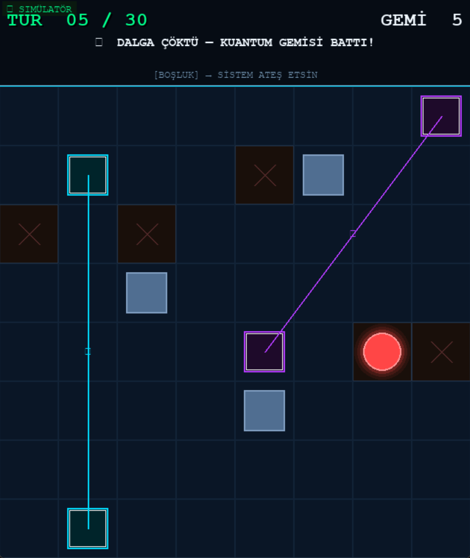

#   Sistem Mimarisi ve Teknik Analiz: Kuantum Amiral Battı

## 1. Proje Özeti (Execution Summary)
Bu proje, klasik Amiral Battı oyun mekaniklerini Qiskit tabanlı kuantum devreleri ile hibrit hale getiren bir strateji uygulamasıdır. Uygulama, gemi koordinatlarını statik veriler yerine süperpozisyon ve olasılık genlikleri ($|0\rangle, |1\rangle$) üzerinden yönetir.

## 2. Kuantum Veri Yapısı ve Gemi Tipleri
Kod, her gemi tipi için farklı bir kuantum devresi (QuantumCircuit) tanımlar:

* **Ghost Ships ($H$ - Hadamard Gate):** Gemi, Hadamard kapısı ile süperpozisyon durumuna ($|0\rangle + |1\rangle$) sokulur. Bu durum, geminin fiziksel olarak aynı anda iki koordinatta bulunmasını sağlar.
    
* **Rigged Ships ($R_y$ Rotation Gate):** Gemi konumu, $R_y(\theta)$ kapısı ile belirli bir açı etrafında döndürülür. Bu sayede geminin bir karede bulunma olasılığı (örneğin %75) matematiksel olarak ağırlıklandırılır.
    

## 3. Oyun Döngüsü ve Ölçüm Postülatı (Game Loop & Measurement)
Sistemin çalışma mantığı kuantum mekaniğindeki "Gözlemci Etkisi" üzerine kuruludur:

1. **Targeting:** Sistem (AI), koordinat evreni içinden tamamen rastgele (random) bir hedef seçer.
2. **Observation (Measurement):** Seçilen koordinat üzerinde bir `measure` (ölçüm) işlemi tetiklenir.
3. **Wavefunction Collapse:** Atış yapıldığı an süperpozisyon durumu çöker; gemi ya o koordinatta "batmış" olarak materialize olur ya da diğer koordinata transfer edilir.

## 4. Teknik Stack ve Altyapı
* **Kuantum Motoru (Backend):** **Qiskit** üzerinden asenkron devre yönetimi.
* **Görselleştirme (Frontend):** **Pygame** modülü (UI tasarımı ve görselleştirme aşamasında yapay zeka desteği alınmıştır).
* **İşlem Birimleri:** Yerel simülasyonlar için **Qiskit Aer**; gerçek atomik işlemler için **IBM Quantum QPU** (API entegrasyonu ile) kullanılır.

## 5. Güvenlik ve Bağlantı Protokolü
* **IBM API Entegrasyonu:** Güvenlik gereği IBM Token bilgileri kod içerisinde saklanmaz; her kullanıcı başlangıç ekranında kendi API anahtarını girerek yetkilendirme sağlar.
* **Qiskit-Pygame Köprüsü:** Kuantum devresinden dönen `counts` verisi, anlık olarak Pygame event döngüsüne parse edilir.

